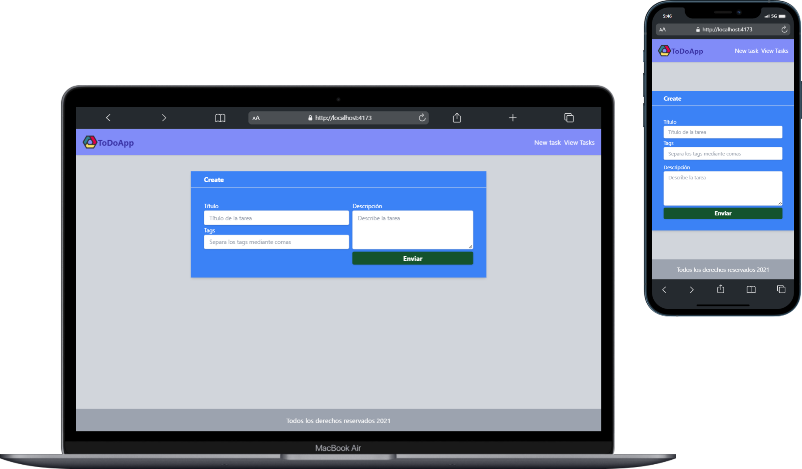
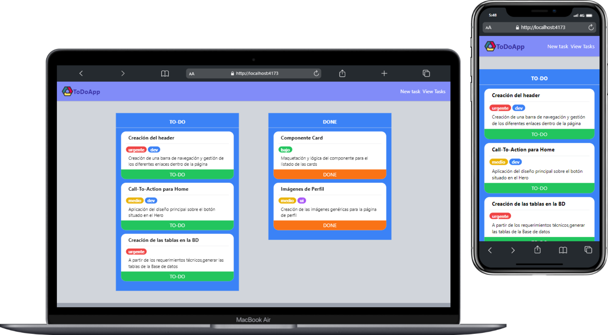

# Todo App
Esta es mi solución a la prueba de Oxygen de hacer un Todo app.

## Tabla de contenidos
- [Todo App](#todo-app)
  - [Tabla de contenidos](#tabla-de-contenidos)
  - [Vista General](#vista-general)
    - [Formulario para crear tareas](#formulario-para-crear-tareas)
    - [Lista de tareas](#lista-de-tareas)
  - [Prueba Técnica](#prueba-técnica)
    - [Descripción](#descripción)
    - [Requerimientos técnicos](#requerimientos-técnicos)
    - [Funcionalidad](#funcionalidad)
    - [Tareas](#tareas)
      - [Primer Nivel](#primer-nivel)
      - [Segundo Nivel](#segundo-nivel)
      - [Tercer Nivel](#tercer-nivel)
  - [Tecnologías](#tecnologías)
    - [Clona este repositorio](#clona-este-repositorio)
  - [Author](#author)
## Vista General
### Formulario para crear tareas

### Lista de tareas

## Prueba Técnica
### Descripción
El objetivo de esta prueba es determinar el nivel del candidato para poder asignarle
el nivel más adecuado y así obtener el mayor rendimiento posible del Training.
En este documento se establecen una serie de retos que el candidato debe intentar.
Lo importante, para poder determinar el nivel es resolver todos los puntos en los que
el candidato se sienta cómodo y dejar aquellas acciones que no domine para, de
esa manera, poder recomendar una ruta de formación óptima.

### Requerimientos técnicos
La aplicación a desarrollar se trata de un sistema de gestión de tareas que muestra
un mapa visual de todas las acciones desarrolladas y pendientes de un proyecto IT.
Con este tipo de aplicaciones se gestiona el control al detalle de las tareas que
estemos llevando a cabo en un proyecto.

### Funcionalidad

1. A través de un formulario el usuario debe ser capaz de introducir los datos básicos de una tarea: título, etiquetas y descripción.
2. Una vez se rellenen los datos del formulario y se pulse el botón “Enviar” la tarea debe quedar registrada como “TO-DO”.
3. Cada uno de los bloques que identifica una tarea debe mostrar de manera  adecuada todos los datos de la misma.
4. Si pulsamos el botón “DONE” disponible en cada tarea, debemos poder pasarla al bloque de las tareas desarrolladas (DONE).

### Tareas
La aplicación debe estar desarrollada con React como framework de desarrollo de
interfaces.

#### Primer Nivel
El desarrollo de la interfaz se debe hacer usando las herramientas disponibles dentro del framework seleccionado sin usar ningún tipo de librería externa.
Se deben establecer de manera correcta la distribución de componentes de la aplicación así como la gestión de los datos que permita la interacción básica entre el formulario y las diferentes vistas.
Se valorarán las buenas prácticas a la hora de programar cada uno de los elementos que formen parte del interfaz.

#### Segundo Nivel
Se debe incluir el uso de alguna librería externa al framework o librería escogida para gestionar el estado de la aplicación.
El manejo de la interfaz gráfica se debe alcanzar incorporando a la aplicación
algún tipo de framework o librería visual (Bootstrap, Tailwind, styled-components...)
Se debe separar el acceso al formulario de las listas a través de un sistema de
rutas que nos permita navegar entre las dos opciones.
#### Tercer Nivel
Desarrollar una API REST JSON utilizando Node.js y Express.
Debe tener rutas para ver todas las tareas, ver una sola tarea, crear una tarea, modificar una tarea y borrar una tarea en un patrón REST estándar. Devolverá
todos los datos en formato JSON y aceptará datos en formato JSON.
Habrá que modificar la aplicación de React para coger sus datos de esta API en vez de tener sus propios datos.
Conecta la API con una base de datos (SQL o Mongo) para guardar las tareas allí.

## Tecnologías
- Maquetación: HTML5
- Estilos: Tailwind CSS
- Funcionalidad: React.js, React Router y ReduX
- Empaquetador: Vite


### Clona este repositorio
```bash
# Clona este repositorio
$ git clone https://github.com/TKadyear/oxygen-todo-app.git

# Entra en la carpeta
$ cd oxygen-todo-app

# Instala las dependencias
$ npm install

# Inicia el servidor de desarrollo
$ npm run dev
```
Para ver el servidor de producción, ejecuta los siguientes comandos:
```bash
# Para preparar los documentos para producción:
$ npm run build

# Inicia el servidor de desarrollo
$ npm run preview
```

## Author
- Github - [TKadyear](https://github.com/TKadyear)
- Linkedin - [Tamara Kadyear Saber](https://www.linkedin.com/in/tamara-kadyear-saber/)

